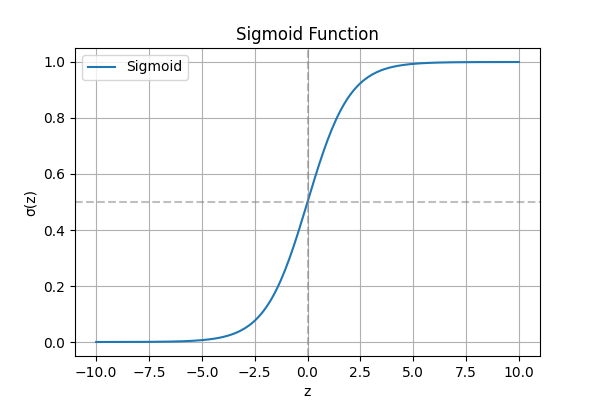
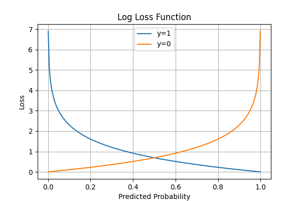

# Logistic Regression
- ### Use case : Binary Classification(0/1)

- ### Model

- **Simple regression equation**

$$
z = w^Tx + b 
$$

- **Sigmod funtion** : maps every input to **(0,1)**
$$
\sigma(z) = \frac{1}{1\;+\; e^{-z} }
$$

### 📈 Sigmoid Function

$$
\hat{p} = \sigma(z)
$$

- **$\hat{p}$** : estimated probability of class 1
- Predict class = 1 if $\hat{p} \geq 0.5$, else 0

### Loss (Log-Loss / Cross-Entropy):

$$
L = -\frac{1}{n}\sum^{n}_{i=1} \left [ \; y_ilog(\hat{p}) \; + (1-y_i)log(1-\hat{p}) \right]
$$

### 🧮 Log Loss Function

>**Q: What this log-loss funtion do?**
>
>It penilises(give high error value) the model if the predicted values is far away from its class.
>As given in graph, for y = 1, if predicted value is close to 0. Then, we get a large error value.
>

- ### Optimization:
- #### Gradiant Decent on w, b.

$$
w = w - \alpha \frac{\delta L}{\delta w}, \;\;\;  b = b - \alpha \frac{\delta L}{\delta b}
$$

where, 

$$
\frac{\delta L}{\delta w} = \frac{1}{n}X^T(\sigma(Xw+b)-y), \;\; \frac{\delta L}{\delta b}=\frac{1}{n}\sum^n_{i=1}(\sigma(z_i)-y_i)
$$

>**Q: How does we get this?**
>
>`Need to minimize  the log loss.  Have to solve this using chain rule.`
>$$
>J(w, b) = -\frac{1}{n}\sum^{n}_{i=1} \left [ \; y_ilog(\hat{y_i}) \; + (1-y_i)log(1-\hat{y_i}) \right]
>$$
>
>where, 
>
>$ \hat{y_i} = \sigma(z_i) = \frac{1}{1\;+\; e^{-z_i} }$
>
>$z_i = w^Tx + b $
>
>
>**1.Find gradient w.r.t. $z^i$**
>$$
>\frac{dJ}{dz^i} = \frac{dJ}{dy^i}.\frac{d \hat{y_i}}{dz_i}
>
>$$
>
>here , 
>
>$$
>\frac{dJ}{d\hat{y_i}} = - \frac{y_i}{\hat{y_i}} \; + \; \frac{1-y_i}{1- \hat{y_i}} 
>$$
>$$
>\frac{dy_i}{dz_i} = \hat{y^i}(1-\hat{y_i})
>$$
>this has a beautiful simplification.
>
>so, After simplification it reduces to this:
>$$
>\frac{dJ}{dz_i} = \hat{y_i} - y_i
>$$
>
>
>**2.Gradient w.r.t. $w$,**
>
>$$
>\frac{\delta J}{\delta w} = \frac{d J}{dz}.\frac{dz}{dw} = \frac{1}{n}\sum(\hat{y}-y).x\;, \;\;\;\; \frac{dz}{dw} = x
>$$
>
>**3.Gradient w.r.t. $b$,**
>$$
>\frac{\delta J}{\delta b} = \frac{dJ}{dz}.\frac{dz}{db} = \frac{1}{n}\sum(\hat{y} - y)\;, \;\;\;\; \frac{dz}{db} = 1$$
>
